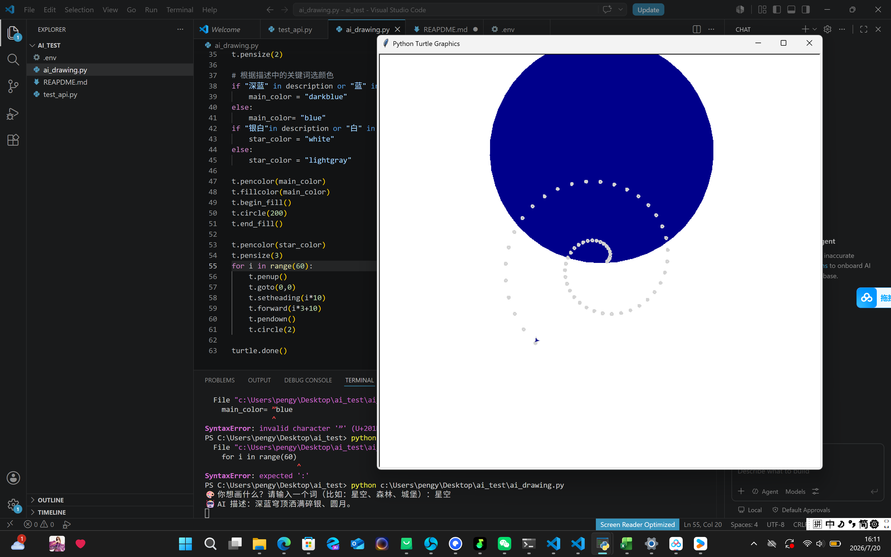

# 🎨 AI 灵感画板 (AI Drawing Board)

这是一个通过 Python 调用 DeepSeek AI 接口，根据用户输入的主题（如“星空”）生成画面描述，并用 Turtle 海龟绘图自动画出来的小程序。

## ✨ 功能特点
- 用户输入任意主题（如：星空、森林、城堡）
- AI 自动生成 20 字以内的画面描述
- 程序根据描述中的颜色和形状关键词，自动绘制对应图形

## 🛠️ 技术栈
- Python 3.x
- DeepSeek API (AI 对话模型)
- Turtle (海龟绘图库)
- python-dotenv (环境变量管理)

## 🚀 如何运行
1. 克隆本仓库到本地
2. 在项目根目录创建 `.env` 文件，并填入你的 API 密钥：
   `DEEPSEEK_API_KEY=你的密钥`
3. 安装依赖：`pip install requests python-dotenv`
4. 运行程序：`python ai_drawing.py`

## 📸 效果展示
